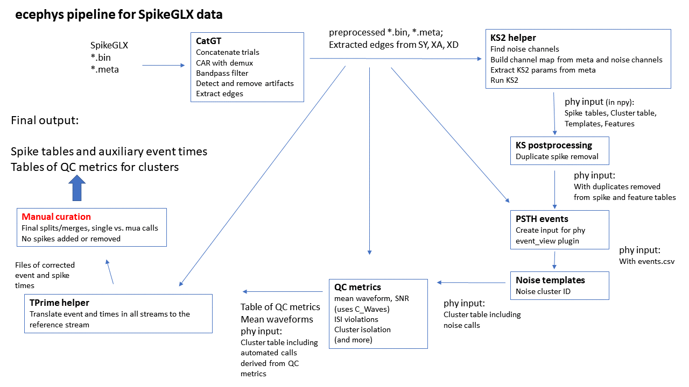

# ecephys spike sorting -- for SpikeGLX data


Modules for processing **e**xtra**c**ellular **e**lectro**phys**iology data from Neuropixels probes, originally developed at the Allen Institute for Brain Science. This fork includes additions for running with SpikeGLX data, including integration of CatGT (preprocessing) and TPrime (synchronization across data streams).

Code including modifications for SpikeGLX
https://github.com/jenniferColonell/ecephys_spike_sorting

Original repo from the Allen Institue
https://github.com/AllenInstitute/ecephys_spike_sorting


## Overview

The general outline of the pipeline is preprocessing, spike sorting by [Kilosort2](https://github.com/MouseLand/Kilosort2) , followed by cleanup and calculation of QC metrics. The original version from the Allen used preprocessing specifically for data saved using the [Open Ephys GUI](https://github.com/open-ephys/plugin-gui). This version is designed to run with data collected using [SpikeGLX](http://billkarsh.github.io/SpikeGLX), and its associated tools (CatGT, TPrime, and C_Waves). The identification of noise clusters and calculation of QC metrics is unchanged from the original code.

The spikeGLX_pipeline.py script implements this pipeline: 



This code is still under development, and we welcome feedback about any step in the pipeline.

## Modules in SpikeGLX Pipeline

Further documentation can be found in each module's README file. For more information on Kilosort2, please read through the [GitHub wiki](https://github.com/MouseLand/Kilosort2/wiki).

1. [catGT_helper](ecephys_spike_sorting/modules/catGT_helper/README.md): Concatenates trials, applies filters, removes artifacts in neural data. Finds edges in sync and auxiliary channels.

2. [kilosort_helper](ecephys_spike_sorting/modules/kilosort_helper/README.md): Generates config files for Kilosort based on SpikeGLX metadata and launches spike sorting via the Matlab engine.

3. [kilosort_postprocessing](ecephys_spike_sorting/modules/kilosort_postprocessing/README.md): Removes putative double-counted spikes from Kilosort output. The algorithm has been changed from the original to delete all between cluster duplicates from the cluster with lower amplitude.

4. [psth_events](ecephys_spike_sorting/modules/psth_events/README.md): Reformat list of events from an auxiliary channel for phy psth plots.

5. [noise_templates](ecephys_spike_sorting/modules/noise_templates/README.md): Identifies noise units based on their waveform shape and ISI histogram or a random forest classifier.

6. [mean_waveforms](ecephys_spike_sorting/modules/mean_waveforms/README.md): Extracts mean waveforms from the raw data, given spike times and unit IDs. Also calculates metrics for each waveform.

7. [quality_metrics](ecephys_spike_sorting/modules/quality_metrics/README.md): Calculates quality metrics for each unit to assess isolation and sorting quality.

7. [tPrime_helper](ecephys_spike_sorting/modules/tPrime_helper/README.md): Maps event times (edges in auxiliary channels, spike times) in all streams to match a reference stream.

### Modules Specific to Open Ephys 

1. [extract_from_npx](ecephys_spike_sorting/modules/extract_from_npx/README.md): Calls a binary executable that converts data from compressed NPX format into .dat files (continuous data) and .npy files (event data)

2. [depth_estimation](ecephys_spike_sorting/modules/depth_estimation/README.md): Uses the LFP data to identify the surface channel, which is required by the median subtraction and kilosort modules.

3. [median_subtraction](ecephys_spike_sorting/modules/median_subtraction/README.md): Calls a binary executable that removes the DC offset and common-mode noise from the AP band continuous file.

(Not used) [automerging](ecephys_spike_sorting/modules/automerging/README.md): Automatically merges templates that belong to the same unit (included in case it's helpful to others).

## Installation and Usage for the SpikeGLX pipeline

These modules have been tested with Python 3.7.

We recommend using [pipenv](https://github.com/pypa/pipenv) to run these modules.

The SpikeGLX pipeline is dependent on three command line applications currently available only for Windows, and has not been tested in Linux or Mac. These instructions are for Windows 10.


### Install pipenv

If the machine doesn't already have python, install it. For the ecephys code, the latest python that's been tested is 3.7; install the latest 3.7.*. Download the Windows x86-64 executable installer and run the exe, selecting the "Add Python to PATH" checkbox at the bottom of the dialog.

If you forget to check the the "Add to PATH" box, it can be added afterward by editing the Environment Variables (under Advanced system settings). The two paths to add are to the Python folder containing the exe, and the scripts folder, e.g.:

C:\Users\labadmin\AppData\Local\Programs\Python\Python38
C:\Users\labadmin\AppData\Local\Programs\Python\Python38\Scripts

Open the Windows command prompt as administrator, and install pipenv:

```shell
    $ pip install --user pipenv
```
The pipenv executable will be in:

C:\Users\labadmin\AppData\Roaming\Python\Python38\Scripts

Add this path to the PATH environment variable.

You may need to close and reopen the command prompt for the new path to be acknowledged.

### Install ecephys

Clone (or download and unzip) the repo. (https://github.com/jenniferColonell/ecephys_spike_sorting)

In the command window navigate to the ecephys_spike_sorting directory at the top level of the repo, e.g.:

cd \Users\labadmin\Documents\ecephys_clone\ecephys_spike_sorting

Build the environment -- it will use the Pipfile located in this directory, and create the virtual environment in the local directory. Then activate the environment and install.

```shell
    $ set PIPENV_VENV_IN_PROJECT=1
    $ pipenv install
    $ pipenv shell
    (.venv) $ pip install .
```
### Set up to run MATLAB from Python

The python version and MATLAB version need to be compatible. For Python 3.7, this requires MATLAB 2019a or later. The code has been tested only with MATLAB 2019b.

Install MATLAB 2019b – side by side installations of MATLAB are fine, so there is no need to delete earlier versions, and running code specific to an earlier version should be possible.

Open MATLAB 2019b, and enter the command gpuDevice(). You make get a message that there are no GPU devices with compatible drivers. Later versions of MATLAB also require more recent drivers for the GPU card – MATLAB 2019b requires version 10.1 or later of the Nvidia drivers. 

If you get that message, quit MATLAB. Update the drivers for the GPU card – for Windows, go to the device manager, select the GPU card from the list of display drivers, and update. After updating, reopen MATLAB and run gpuDevice(); the GPU should now be found, and the driver version (as of 1/4/2020) will be 10.1.

The MATLAB engine for python must be installed in the local instance of python run by the virtual environment. Open the command prompt as administrator, navigate to the ecephys directory, and enter:

```shell
$ pipenv shell
(.venv) $ cd <matlabroot>\extern\engines\python
(.venv) $ python setup.py install
```

Replace <matlabroot> with the root directory of your MATLAB 2019b installation, for example: 

C:\Program Files\MATLAB\2019b

For more details about installing the python engine, see the MATAB documentation:

https://www.mathworks.com/help/matlab/matlab_external/install-the-matlab-engine-for-python.html

NOTE: This install needs to be repeated whenenver the virtual environment is rebuilt (e.g. after creating a new clone or download of the repo).

After completing the install, close the command window and reopen as a normal user (not administrator) to run scripts.

## Usage

### Edit parameters for your system and runs

Parameters are set in two files. Values that are constant across runs—like paths to code, parameters for sorting, etc – are set in create_input_json.py. Parameters that need to be set per run (run names, which triggers and probes to process…) are set in script files.

In the create_input_json.py file, be sure to set these paths for your system:

- ecephys_directory: parent directory that contains the modules directory

- kilosort_repository

- npy_matlab_repository

- catGTPath: contains the CatGT.exe file

- cWaves_path: contains the C_Waves.exe file

- tPrimePath: contains the TPrime.exe file

- kilosort_output_temp: for the KS2 residual file, also temporary copies of the config and master file

Other “mostly constant” parameters in create_input_json:

- Kilosort2 parameters

- kilosort post processing params

- quality metrics params

### Running scripts

The scripts generate a command line to run specific modules using parameters stored in a json file, which is created by the script. Create a directory to hold the json files, e.g. 

\Users\labadmin\Documents\ecephys_clone\json_files

There are two example scripts for running with SpikeGLX data:

**spikeGLX_pipeline.py**
Runs CatGT followed by other modules run on the extracted data. The CatGT log file is parsed to extract the (gfix edits/sec) metric. Currently this is simply written to the command window, but the value could be logged or processing stopped/skipped for bad values. Finally runs TPrime. See comments in the script file for parameter details.

**spikeGLX_noCatGT_pipeline.py**
Runs modules on data that has already been processed, in particular, doesn’t require the CatGT output to be in the run_folder/probe_folder hierarchy. 

For either script, edit to set the destination for the json_files, and the location of the input run files. Edit the list of modules to include those you want to run. For the full pipeline script, you also need to set the CatGT and TPrime parameters.

These scripts are easy to customize to send the output to different directories. 

To run scripts, navigate to the ecephys_spike_sorting\scripts directory and enter:

```shell
   (.venv)$ python <script_name.py>
```


## Multiplatform installation for original pipeline

These modules require **Python 3.5+**, and have been tested with Python 3.5, 3.6, and 3.7.

Three of the modules (`extract_from_npx`, `median_subtraction`, and `kilosort_helper`) have non-Python dependencies that will need to be installed prior to use.

We recommend using [pipenv](https://github.com/pypa/pipenv) to run these modules. From the `ecephys_spike_sorting` top-level directory, run the following commands from a terminal:

### Linux

```shell
    $ pip install --user pipenv
    $ export PIPENV_VENV_IN_PROJECT=1
    $ pipenv install
    $ pipenv shell
    (ecephys_spike_sorting) $ pip install .
```
You can now edit one of the processing scripts found in `ecephys_spike_sorting/scripts` and run via:

```shell
    (ecephys_spike_sorting) $ python ecephys_spike_sorting/scripts/batch_processing.py
```
See the scripts [README](ecephys_spike_sorting/scripts/README.md) file for more information on their usage.

To leave the pipenv virtual environment, simply type:

```shell
    (ecephys_spike_sorting) $ exit
```

### macOS

If you don't have it already, install [homebrew](https://brew.sh/). Then, type:

```shell
    $ brew install pipenv
    $ export PIPENV_VENV_IN_PROJECT=1
    $ pipenv install
    $ pipenv shell
    (ecephys_spike_sorting) $ pip install .
```
You can now edit one of the processing scripts found in `ecephys_spike_sorting/scripts` and run via:

```shell
    (ecephys_spike_sorting) $ python ecephys_spike_sorting/scripts/batch_processing.py
```
See the scripts [README](ecephys_spike_sorting/scripts/README.md) file for more information on their usage.

To leave the pipenv virtual environment, simply type:

```shell
    (ecephys_spike_sorting) $ exit
```

### Windows

```shell
    $ pip install --user pipenv
    $ set PIPENV_VENV_IN_PROJECT=1
    $ pipenv install
    $ pipenv shell
    (.venv) $ pip install .
```
**Note:** This will work in the standard Command Prompt, but the [cmder console emulator](https://cmder.net/) has better compatibility with Python virtual environments.

You can now edit one of the processing scripts found in `ecephys_spike_sorting\scripts` and run via:

```shell
    (.venv) $ python ecephys_spike_sorting\scripts\batch_processing.py
```
See the scripts [README](ecephys_spike_sorting/scripts/README.md) file for more information on their usage.

To leave the pipenv virtual environment, simply type:

```shell
    (.venv) $ exit
```

## Level of Support

This code is an important part of the internal Allen Institute code base and we are actively using and maintaining it. The implementation is not yet finalized, so we welcome feedback about any aspects of the software. If you'd like to submit changes to this repository, we encourage you to create an issue beforehand, so we know what others are working on.


## Terms of Use

See [Allen Institute Terms of Use](https://alleninstitute.org/legal/terms-use/)


© 2019 Allen Institute for Brain Science