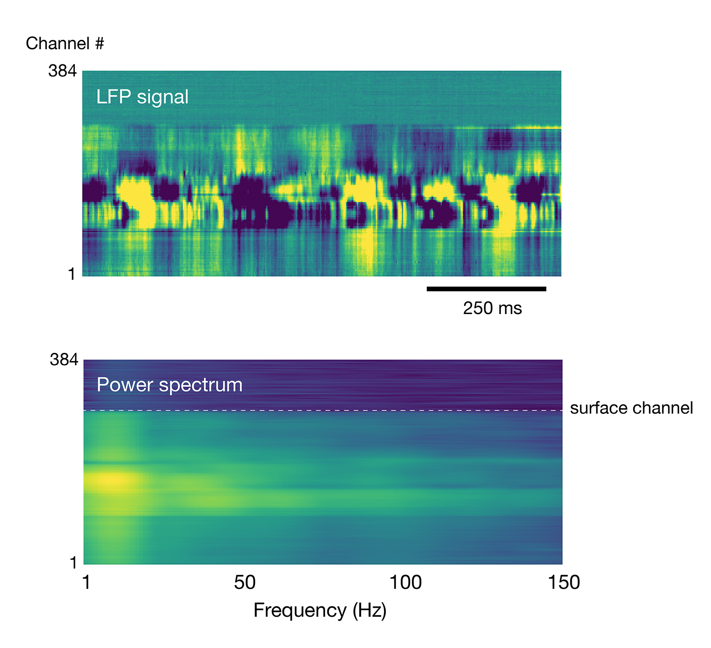

Depth Estimation
==============
Creates a JSON file with information about the DC offset of each channel, as well as the channel closest to the brain surface. In the current SpikeGLX pipeline version this information is not fed forward into kilosort.

Implementation
--------------


This module uses the sharp increase in low-frequency LFP band power to estimate the brain surface location.

Running
-------
```
python -m ecephys_spike_sorting.modules.depth_estimation --input_json <path to input json> --output_json <path to output json>
```
Two arguments must be included:
1. The location of an existing file in JSON format containing a list of paths and parameters.
2. The location to write a file in JSON format containing information generated by the module while it was run.

See the `_schemas.py` file for detailed information about the contents of the input JSON.

Input data
----------
- LFP band .bin file matching the ap band file currently beign processed. With the standard pipeline script, the LFP must have been processed by CatGT.

Output data
-----------
- **probe_info.json** : contains information about each channel, as well as the surface channel for the probe
- **probe_depth.png** : image showing the estimated surface channel location