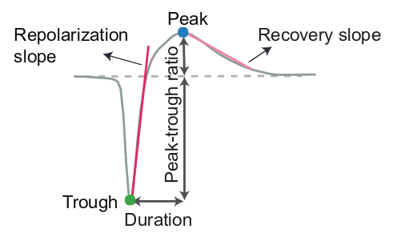
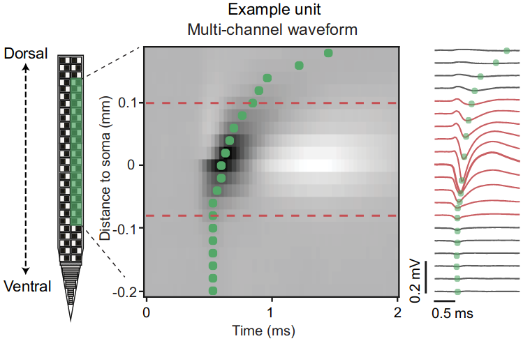
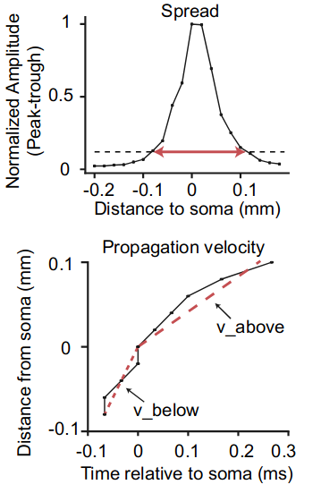

Mean Waveforms
==============
Extracts mean waveforms and compute waveform metrics from raw data, given spike times and cluster IDs.

Dependencies
------------
[C_Waves](http://billkarsh.github.io/SpikeGLX/#post-processing-tools)

Mean Waveform Calculation
=========================

**In the original Allen Institute implementation:**
Computes waveforms separately for individual epochs, as well as for the entire experiment. If no epochs are specified, waveforms are selected randomly from the entire recording. Waveform standard deviation is currently computed, but not saved.

**In the Janelia revised implementation:**
Computes waveforms using Bill Karsh's command line tool C_Waves. This version does not support epochs; spikes are drawn uniformly from the entire recording. The SNR is calculated over a disk of recording sites, and is given by:

(Vmax - Vmin) on the peak channel/(2*sqrt(variance))

variance = (1/(N-degrees of freedom))*sum(residuals^2)

residuals = channel x sample array of (raw data - mean)

The variance and residuals are calculated only over the first 15 points in the waveform -- this gives a measure of noise that is independent of the variation in amplitude and shape of the spikes included in the cluster.

The radius of the disk, given in number of sites, is an input parameter to C_Waves. **create_input_json.py** takes as a parameter the radius specified in um (c_Waves_snr_um) and translates it into sites for the probe type read in the SpikeGLX meta file. 

The C_Waves implementation is very efficient. It is turned on in **create_input_json.py** by setting:

```
    use_C_Waves : True
```

Waveform Metric Calculation
===========================

Metrics are computed for every waveform, and include features of the 1D peak-channel waveform and the 2D waveform centered on the soma location.



**1D waveform features**: Waveform duration, peak-trough ratio, repolarization slope, and recovery slope.



**Example 2D waveform**: Signals from channels along one column of the probe are smoothed with a moving average to create the 2D waveform. Green dots indicate the location of the waveform trough on each channel.



**2D waveform features**: Waveform spread, velocity above the soma, and velocity below the soma.

Source: [Jia et al. (2019) "High-density extracellular probes reveal dendritic backpropagation and facilitate neuron classification." _J Neurophys_ **121**: 1831-1847](https://doi.org/10.1152/jn.00680.2018)


Running
-------
```
python -m ecephys_spike_sorting.modules.mean_waveforms --input_json <path to input json> --output_json <path to output json>
```
Two arguments must be included:
1. The location of an existing file in JSON format containing a list of paths and parameters.
2. The location to write a file in JSON format containing information generated by the module while it was run.

See the `_schemas.py` file for detailed information about the contents of the input JSON.

Input data
----------
- **AP band .dat or .bin file** : int16 binary files written by [Open Ephys](https://github.com/open-ephys/plugin-GUI), [SpikeGLX](https://github.com/billkarsh/spikeglx), or the `extract_from_npx` module.
- **Kilosort outputs** : includes spike times, spike clusters, cluster quality, etc.


Output data
-----------
- **mean_waveforms.npy** : numpy file containing mean waveforms for clusters across all epochs
- **waveform_metrics.csv** : CSV file containing metrics for each waveform