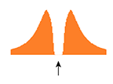
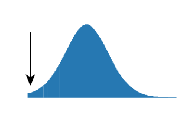
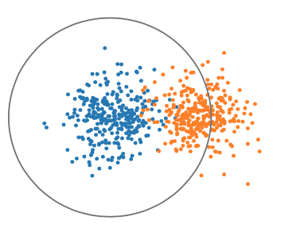
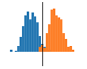
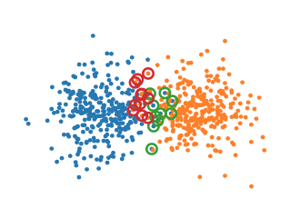

# Quality Metrics

Computes quality metrics for sorted units. Similar to the `mean_waveforms` module, this module can calculate metrics separately for individual epochs. If no epochs are specified, metrics are computed for the entire recording.

## Included Metrics

| Metric             | Icon                     | Description                                        |    Reference     |
| ------------------ |:------------------------:| -------------------------------------------------- | -----------------|
| Firing rate        |                          | Mean spike rate in an epoch                        |                  |
| Presence ratio     |                          | Fraction of epoch in which spikes are present      |                  |
| ISI violations     |  | Rate of refractory-period violations               |                  |
| Amplitude cutoff   |   | Estimate of miss rate based on amplitude histogram |                  |
| Isolation distance | | Distance to nearest cluster in Mahalanobis space   | Schmitzer-Torbert et al. (2005) _Neuroscience_ **131**, 1-11 |
| L-ratio            |                          |                                                    |         "         |
| _d'_               |   | Classification accuracy based on LDA               | Hill et al. (2011) _J Neurosci_ **31**, 8699-9705 |
| Nearest-neighbors  || Non-parametric estimate of unit contamination      | Chung et al. (2017) _Neuron_ **95**, 1381-1394 |
| Silhouette score  |                           | Standard metric for cluster overlap      |         |
| Maximum drift     |                           | Maximum change in spike depth throughout recording    |         |
| Cumulative drift  |                           | Cumulative change in spike depth throughout recording |         |

### A Note on Calculations

For metrics based on waveform principal components (isolation distance, L-ratio, _d'_, and nearest neighbors hit rate and false alarm rate), it is typical to compute the metrics for all pairs of units and report the "worst-case" value. We have found that this tends to under- or over-estimate the degree of contamination when there are large firing rate differences between pairs of units that are being compared. Instead, we compute metrics by sub-selecting spikes from _all_ other units on the same set of channels, which seems to give a more accurate picture of isolation quality. We would appreciate feedback on whether this approach makes sense.

The regions over which templates are compared and units are considered "close" are set by the parameter 'max_radius_um' in create_input_json. It is set by default to 68 um, which is equivalent to 13 sites on a NP 1.0 probe.

The %false positive metric derived from ISI violations has been amended from the original to NOT assume that the fraction of false positve spikes << 1. In this case, the fraction of false positives is the root of a quadratic equation -- when there is no real root (at high fracton false positives) the output fraction of false positives is set to 1.0.


## Running

```
python -m ecephys_spike_sorting.modules.quality_metrics --input_json <path to input json> --output_json <path to output json>
```
Two arguments must be included:
1. The location of an existing file in JSON format containing a list of paths and parameters.
2. The location to write a file in JSON format containing information generated by the module while it was run.

See the `_schemas.py` file for detailed information about the contents of the input JSON.


## Input data

- **Kilosort outputs** : includes spike times, spike clusters, cluster quality, etc.


## Output data

- **metrics.csv** : CSV containing metrics for all units